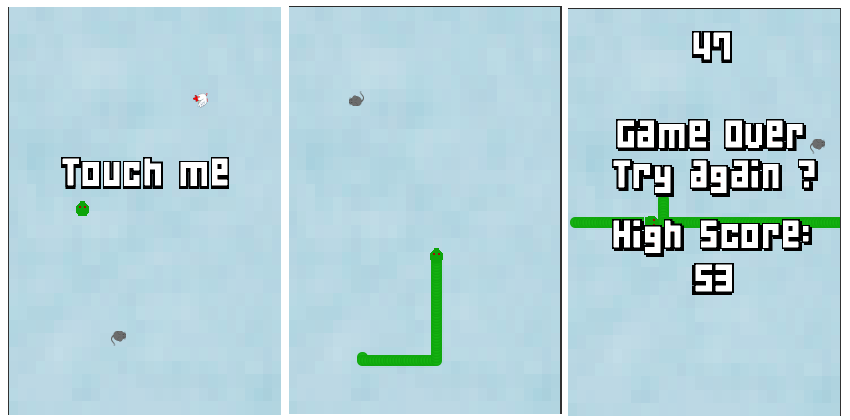

Sneik
=====
My small Android (and then some) game using [libgdx](http://libgdx.badlogicgames.com/). This is just a toy project for getting more familiar with libgdx and game development.

About
=====
Ive used the libgdx project generator tool for getting started with the project, and from there [Intellij IDEA](https://www.jetbrains.com/idea/). The project should be adapted for other development environments as well.

Credits
=======
Thanks to [KiloBolt](http://www.kilobolt.com) for the fantastic [Zombie bird tutorial](http://www.kilobolt.com/zombie-bird-tutorial-flappy-bird-remake.html)
